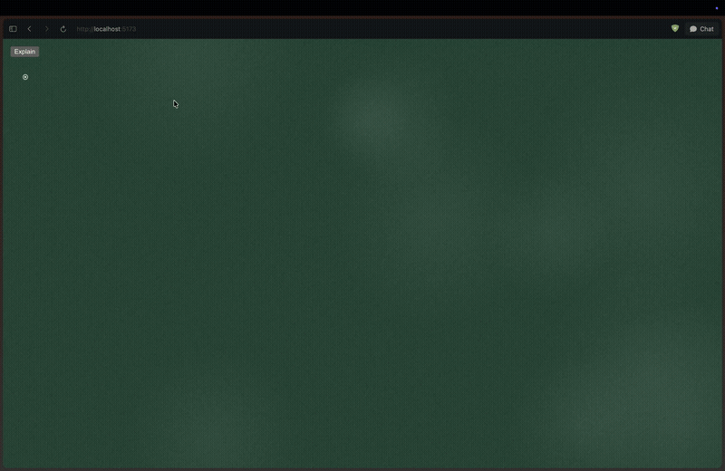

# @regisrex/magnesium

[](https://www.npmjs.com/package/@regisrex/magnesium)
[](https://github.com/regisrex/magnesium/actions/workflows/ci.yml)
[](LICENSE)

A chalkboard component that an AI agent writes on. Handwriting appears stroke by stroke, LaTeX renders as chalk (chemistry via `\ce{}`), shapes are drawn with the chalk visibly travelling, and the board knows what is already on it so text steps down to free space instead of overwriting.



*(Full-quality recording: [sample.mp4](sample.mp4))*

```
npm install @regisrex/magnesium
```

Peer dependency: React 17+. MathJax and the Kalam handwriting font are loaded from CDNs on first use; pass `loadMathJax={false}` / `loadFont={false}` if you ship them yourself.

Ships as plain JS (`.js`/`.jsx`, no build step) with hand-written `.d.ts` declarations alongside, so TypeScript projects get full types (`ChalkBoardProps`, `ChalkBoardHandle`, `BoardCommand`, `BoardState`, ...) with no extra setup — just `import { ChalkBoard } from '@regisrex/magnesium'` from a `.tsx` file.

## Basic use

```jsx
import { ChalkBoard, useChalkBoard } from '@regisrex/magnesium';

function Lesson() {
  const board = useChalkBoard();
  return (
    <>
      <ChalkBoard ref={board.ref} board="green" size={36} />
      <button onClick={() => board.exec([
        { op: 'at', x: 80, y: 110 },
        { op: 'write', text: 'Pythagoras', size: 44 },
        { op: 'mark', name: 'text' },
        { op: 'triangle', points: [[1150, 160], [1150, 620], [1750, 620]], color: 'yellow' },
        { op: 'angle', x: 1150, y: 620, r: 60, a1: 0, a2: 90, color: 'white' },
        { op: 'label', x: 1105, y: 150, text: 'A' },
        { op: 'back', name: 'text' },
        { op: 'math', tex: 'c^2 = a^2 + b^2', color: 'yellow' }
      ])}>Draw</button>
    </>
  );
}
```

`exec` is queued: an agent can call it again while the previous batch is still animating and the commands run in order. It resolves when the chalk stops.

## Ref handle

| method | purpose |
|---|---|
| `exec(commands)` | run JSON commands (array, or `{commands:[...]}` straight from a tool call) |
| `run(script)` | run the line-based script format (`at 80 110`, `math x^2`, …) |
| `state()` | pen position, marks, percent used, free space per region, a large and medium free spot |
| `snapshot()` | PNG data URL of the board, for a vision model or saving |
| `isFree(x,y,w,h)`, `findFree(w,h)` | occupancy queries |
| `clear()`, `stop()`, `busy()` | control |
| `board` | the underlying `BoardWriter` instance |

## Props

`width`/`height` (default 1920×1080, board coordinates), `board` (`green` | `black` | `plain`), `chalk`, `avoid` (text/math avoid existing chalk, default true), `size`, `color`, `speed`, `font`, `showPen`, `showOccupancy`, `cursor` (`ring` default | `hand` — a writing-hand emoji | `none` | `(ctx, tip, pen) => void` for a fully custom pen indicator), `mode` (`none` | `place` — click sets the pen | `draw` — freehand chalk for a human), `onReady(handle)`, `onIdle()`, `onError(e)`, `className`, `style`.

## Wiring an agent

`BOARD_TOOL` is a ready tool definition (Anthropic `input_schema` shape; the same object works as OpenAI `parameters`) and `boardSystemPrompt()` explains the coordinate system and commands to the model. See `example/App.jsx` for a full tool-use loop: send the question plus `board.state()`, execute each `write_on_board` call with `board.exec(input.commands)`, return the new `state()` as the tool result, repeat until the model stops calling the tool.

Agents place figures by coordinates, so give them `state()` (it reports free regions) or a `snapshot()` if the model can see images. Text and equations self-correct: if an agent points the pen at occupied space, the writing steps down until the line is clear. Shapes and labels go exactly where asked.

## Commands

| op | fields |
|---|---|
| `at` | `x, y` — jump pen; new lines wrap back to this x |
| `move` | `x, y` — glide the chalk there |
| `mark` / `back` | `name` — save / return to a writing position |
| `wrap` | `x2` — right edge for wrapping |
| `write` | `text` (inline math `$...$`), optional `color`, `size`, `x`, `y` |
| `math` | `tex`, optional `color`, `size`, `x`, `y` |
| `label` | `x, y, text` — write at a point, cursor unchanged |
| `line`, `arrow` | `x1, y1, x2, y2` |
| `box` | `x, y, w, h` |
| `triangle`, `polygon` | `points: [[x,y], ...]` |
| `circle` | `cx, cy, r` |
| `arc` | `cx, cy, r, a1, a2` (degrees, 0 right, 90 up) |
| `angle` | `x, y, r, a1, a2`, optional `text` (LaTeX); 90° draws the square mark |
| `dot` | `x, y` |
| `underline`, `pause` (`ms`), `clear`, `color` (`color`), `size` (`size`) | |

Colours: `white`, `yellow`, `blue`, `pink`, `green`, or any hex.
